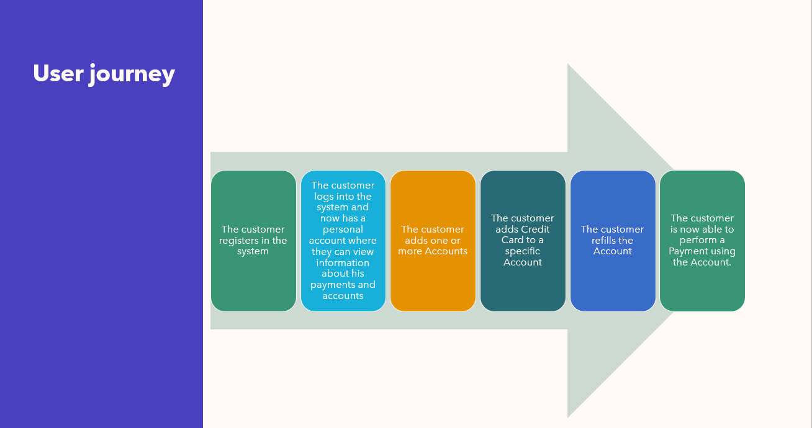
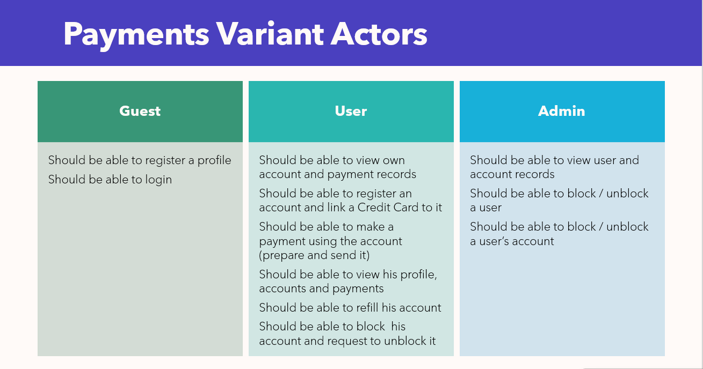

+++
title = "Java Epam Trainee" 
description = ""
cover="/projects/java_epam_trainee/learn_logo.png"
type = ["posts","post"]
tags = [
    "java",
    "courses",
    "dev",
]
date = "2023-05-30"
linktitle= "Java Epam Trainee"

categories = [
    "self-development",
    "courses",
]

+++
 
 
## Overview
 Epam Java University External Course prepares individuals for a new career in IT and includes the following modules:
* Basics of Computer Science
* Version Control with Git
* [Java Core + Collections and Streams + Web Programming Basics](/certificates/java/)
* [Design ](/certificates/design/)
* [Databases](/certificates/db/)
* [Testing](/certificates/testing/)
* [Spring Framework](/certificates/spring/)
* [Final Project](https://github.com/lublyanka/epam_final_task)
-----------------
## Final Project
Fot the final project I chose Payment varian. 
https://github.com/lublyanka/epam_final_task 

In this project, I have successfully implemented a simplified account-payment system. 
During the development, I have managed to create a user interface for customers and administrator and did it in allocated time-frame. 
Throughout the project, I have learned about payment processing and developed and strengthened skills in Java and JavaScript.

#### Used technologies
* Spring boot
	* Security
	* Authorization
	* Log4j2 
	* JPA, Hibernate (Pageable)
* ThymeLeaf  
* Materialize 
* Gradle
* Lombok 
* JWT (io.jsonwebtoken)
* Junit5 + Mockito
* Swagger
* reCAPTCHA

 

 
 

